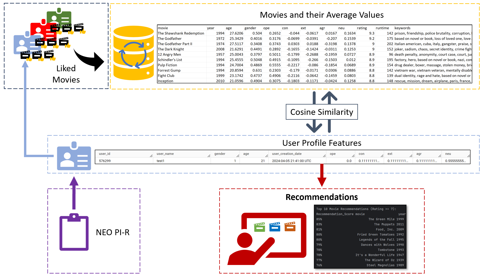
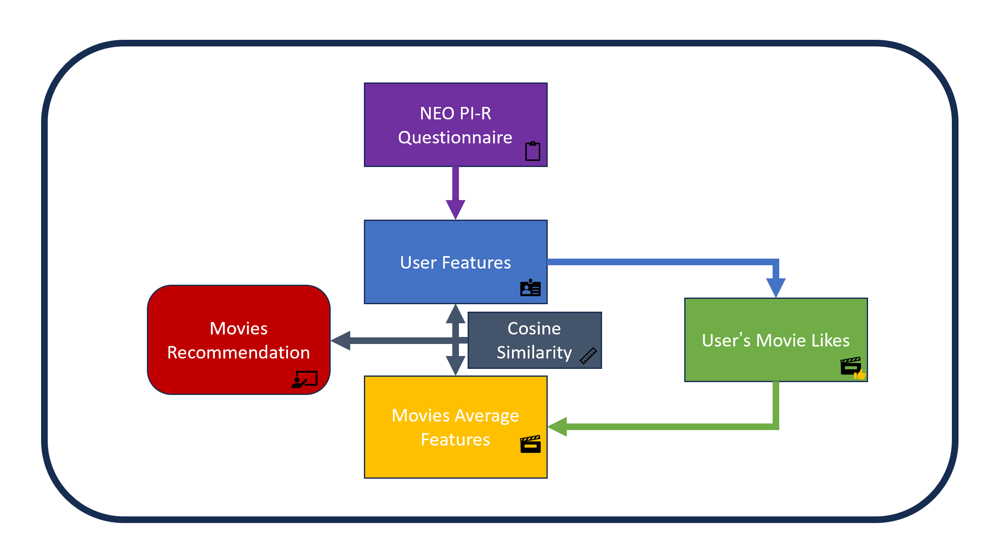

# OCEAN-Movie-Recommender
This algorithm is able to recommend movies based on the user's personality traits.
   
## Description
This algorithm recommends to the user the movies that it thinks are the most suitable based on the user's personality traits according to the Big Five theory.   
   
The Big Five or OCEAN model is a framework in psychology that identifies five broad personality traits: Openness, Conscientiousness, Extraversion, Agreeableness, and Neuroticism. These traits are used to describe human personality and predict behavior.
   
By evaluating these traits in the user, the algorithm is able to predict the movies that best suit their personality type. The different levels of each trait coalesce into a certain personality type.
   
## Methodology
We have a dataset of movies and aggregated averages of the personality traits for each movie. The MyPersonality dataset derived from a Facebook app comprises personality scores of user's that liked these movies based on the Big Five traits, along with demographic and profile data from users who consented to share their information for research (Approximately 1000 users). The dataset we have contains a list of about 850 movies that facebook user's liked and their aggregated average measures in terms of each personality trait, including age and gender (data on each user is not currently available). the average ratings of each movie are from IMDB website and are not based on MyPersonality users.
    
First, each new user is given a personality questionnaire that measures the Big Five traits (NEO PI-R).     
     
The algorithm loads and preprocesses the dataset of movie attributes and the measured user personality traits (we use a data warehouse to store the data). It then computes movie recommendations based on the cosine similarity between a user's personality traits and the movies attributes like their average aggregated traits measures, gender, age, and unique keywords.
   
Finally, a GUI application simulation that interacts with the dataset manage user movie preferences based on their Big Five personality traits. This simulation allows a user to log in with their ID to select the movies they like. User selections are used to update personality trait and other features data in the dataset based on their liked movies, potentially altering the dataset for future recommendations.

