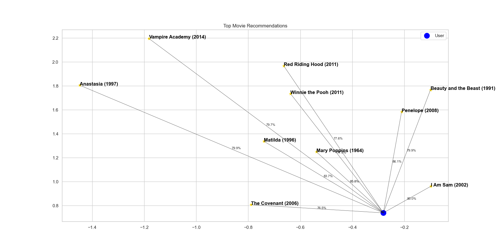

# OCEAN-Movie-Recommender
This is a framework for an algorithm that is able to recommend movies based on the user's Big Five personality traits.  
(OCEAN - Openness, Conscientiousness, Extraversion, Agreeableness, and Neuroticism)   
   
## Description
The Big Five or OCEAN model in psychology identifies five broad personality traits: Openness, Conscientiousness, Extraversion, Agreeableness, and Neuroticism. These traits are used to describe human personality and predict behavior.
   
By evaluating the scoring of these traits in users, the algorithm is able to predict the movies that best suit their personality type.
   
## Methodology   
The MyPersonality dataset derived from a Facebook app comprises personality scores of user's that liked certain movies, along with demographic and profile data from users who consented to share their information for research (Approximately 1000 users).   

The dataset we have contains a list of about 850 movie titles facebook user's liked and their aggregated average measures of the users in terms of each personality trait, including age and gender (currently, data per user is not available).
   
1. Each new user is given a personality questionnaire that measures their Big Five personality traits (NEO PI-R).     
2. The algorithm loads the dataset of movie attributes and their average measured user personality traits (we use a data warehouse to store the data).
3. It then computes movie recommendations based on the cosine similarity between a user's personality traits and the movies aggregated features like their average trait measures, gender, age, and the movies unique keywords.
4. Finally, a GUI application simulation that interacts with the dataset manage user movie preferences based on their Big Five personality traits. This simulation allows a user to log in with their ID to select the movies they like. User selections are used to update personality traits including other features in the dataset based on their liked movies, potentially altering the dataset for future recommendations.
   
In case we have enough user profiles and their features, we can create a more advanced Collaborative Filtering (CF) system and use it for movie recommendations.




```bash
git clone https://github.com/reab5555/OCEAN-Movie-Recommender.git
cd OCEAN-Movie-Recommender
pip install -r requirements.txt


