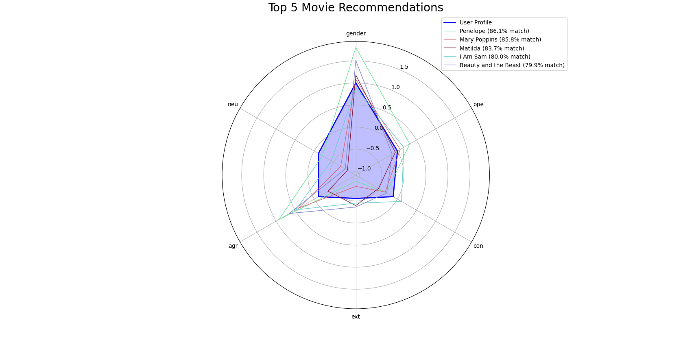

# OCEAN-Movie-Recommender
This project framework present a recommendation system that recommend movies based on the user's Big Five personality traits and movies keywords.  

Predictions are made using the following features:

- **Big Five Personality Traits**
- **Gender**
- **Movie Genre**
- **Movie Keywords**
   
## Description
The Big Five or OCEAN model in psychology identifies five broad personality traits: Openness, Conscientiousness, Extraversion, Agreeableness, and Neuroticism. These traits are used to describe human personality and predict behavior.
   
By evaluating the scoring of these traits in users, the algorithm is able to predict the movies that best suit their personality type.   

The preassumption is that users with similar perosnality traits and gender will more likely prefer movies from specific genres and movies with specific keywords.    

## myPersonality
  
The MyPersonality dataset derived from a Facebook app comprises personality scores of user's that liked certain movies, along with demographic and profile data from users who consented to share their information for research (Approximately 1000 users). 

The dataset we have contains a list of about 850 movie titles facebook user's liked and their aggregated average measures of the users in terms of each personality trait, including age and gender (currently, data per user is not available). further more, it include other demographic data, as well as ratings and keywords from IMDb.

## Methodology   

1. Each new user is given a personality questionnaire that measures their Big Five personality traits (NEO PI-R).     
2. The algorithm loads the dataset of movie attributes and their average measured user personality traits and associated movie genre keywords (we use a data warehouse such as Google BigQuery to store the data).
3. It then computes movie recommendations based on the cosine similarity (or using k-nearest neighbors algorithm that measure distance) between a user's personality traits and the movies aggregated features like their average trait measures, gender, age, and the movies genre unique keywords.
4. Finally, a GUI application simulation that interacts with the dataset manage user movie preferences based on their Big Five personality traits. This simulation allows a user to log in with their ID to select the movies they like. User selections are used to update personality traits including other features in the dataset based on their liked movies, potentially altering the dataset for future recommendations.
   
In case we have enough user profiles and their features, we can create a more advanced Collaborative Filtering (CF) system and use it for movie recommendations.

## Sample Data

Below is a sample of the dataset, showing the aggregated Big Five personality traits (each movie represent a combination of personality traits):

| Movie                    | Ope     | Con     | Ext     | Agr     | Neu     | Gender |
|--------------------------|---------|---------|---------|---------|---------|--------|
| The Shawshank Redemption | 0.2652  | -0.044  | -0.0617 | 0.0167  | 0.1634  | 0.504  |
| The Godfather            | 0.3176  | -0.0699 | -0.0391 | -0.207  | 0.1539  | 0.4016 |
| The Dark Knight          | 0.2892  | -0.1655 | -0.1424 | -0.0311 | 0.1253  | 0.4491 |
| The Godfather Part II    | 0.3743  | 0.0303  | 0.0188  | -0.3198 | 0.1378  | 0.3408 |
| 12 Angry Men             | 0.5011  | -0.1799 | -0.2688 | -0.1959 | 0.0727  | 0.3797 |

These scores represent the average personality trait levels of users who liked each movie.

----------------------------------------------------------------------------------------------------------------

| Movie          | iMDB Keywords                                                                                                                                                                           |
|----------------|------------------------------------------------------------------------------------------------------------------------------------------------------------------------------------|
| The Departed   | police, undercover, boston, massachusetts, gangster, irish-american, crime boss, friends, remake, mobster, organized crime, mafia, undercover cop, mole, state police, police training, realtor |
| The Green Mile | mentally disabled, based on novel or book, southern usa, psychopath, death row, jail guard, supernatural, great depression, prison guard, jail, electric chair, torture, magic realism, healing, 1930s, abuse of power |
| The Lion King  | africa, lion, prince, redemption, musical, uncle, remake, grief, king, family, sidekick, live action and animation, father son relationship, live action remake                   |
| The Pianist    | concert, nazi, resistance, warsaw ghetto, polish resistance, homeland, holocaust (shoah), hunger, world war ii, prisoner of war, ghetto, deportation, jew persecution, liberation, biography, survival, based on memoir or autobiography, pianist, poland |   

Here we can see an example of movies and their keywords.   

----------------------------------------------------------------------------------------------------------------




----------------------------------------------------------------------------------------------------------------

```bash
git clone https://github.com/reab5555/OCEAN-Movie-Recommender.git
cd OCEAN-Movie-Recommender
pip install -r requirements.txt


